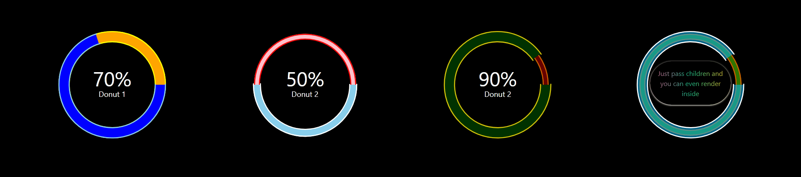

# Progress Bar with Filling Animation
<hr/>
This is ReactJS project made using TailwindCSS. This is a simple project in which we showcase a donut shaped chart which can be used to show some data maybe ... or your progress in your portfolio.


### You can use the below properties to configure .. they are self explanatory ...enjoy :)
<div style="color:cornflowerblue;">
<li>percentage <i style="color:red;">required</i></li>
<li>topic <i style="color:red;">required if children not passed</i> </li>
<li>radius  <i style="color:red;">required</i></li>
<li>innerCircleWidth</li>
<li>outerCircleWidth</li>
<li>outerColor</li>
<li>outerBorderColor</li>
<li>innerColor</li>
<li>innerBorderColor</li>
<li>children  <i style="color:red;">children inside the component</i></li>
<li>time  <i style="color:red;">time to complete full animation</i></li>
<li>animation  <i style="color:red;">enable animation or not</i></li>
</div>



#### Code for this sample 

```js
    <div className="h-64 w-64">
        <ProgressBar
            percentage={70}
            topic={'Donut 1'}
            radius={45}
        />
    </div>
    <div className="h-64 w-64">
        <ProgressBar
            percentage={50}
            topic={'Donut 2'}
            radius={45}
            innerCircleWidth={5}
            innerColor={'pink'}
            innerBorderColor={'red'}
            outerColor={'skyblue'}
            outerBorderColor={'white'}
            outerCircleWidth={7}
            time={3}
        />
    </div>
    <div className="h-64 w-64">
        <ProgressBar
            percentage={90}
            topic={'Donut 2'}
            radius={45}
            innerCircleWidth={5}
            innerColor={'rgb(100, 0, 0)'}
            innerBorderColor={'rgb(204,93,1)'}
            outerColor={'rgb(0, 50, 0)'}
            outerBorderColor={'rgb(208,191,9)'}
            outerCircleWidth={10}
            time={0.5}
        />
    </div>
    <div className="h-64 w-64">
        <ProgressBar
            percentage={90}
            topic={'Donut 2'}
            radius={45}
            innerCircleWidth={5}
            innerColor={'rgba(89,215,0,0.54)'}
            innerBorderColor={'rgb(204,93,1)'}
            outerColor={'rgba(3,189,255,0.53)'}
            outerBorderColor={'rgb(255,255,255)'}
            outerCircleWidth={10}
            animation={true}
            time={10}
        >
            <div className="text-center text-transparent top-16 relative mx-6 py-4 text-md bg-clip-text bg-gradient-to-r from-pink-500 via-emerald-500 to-amber-400 shadow-amber-50 shadow p-2 rounded-full">
                Just pass children and you can even render inside
            </div>
        </ProgressBar>
    </div>
```
